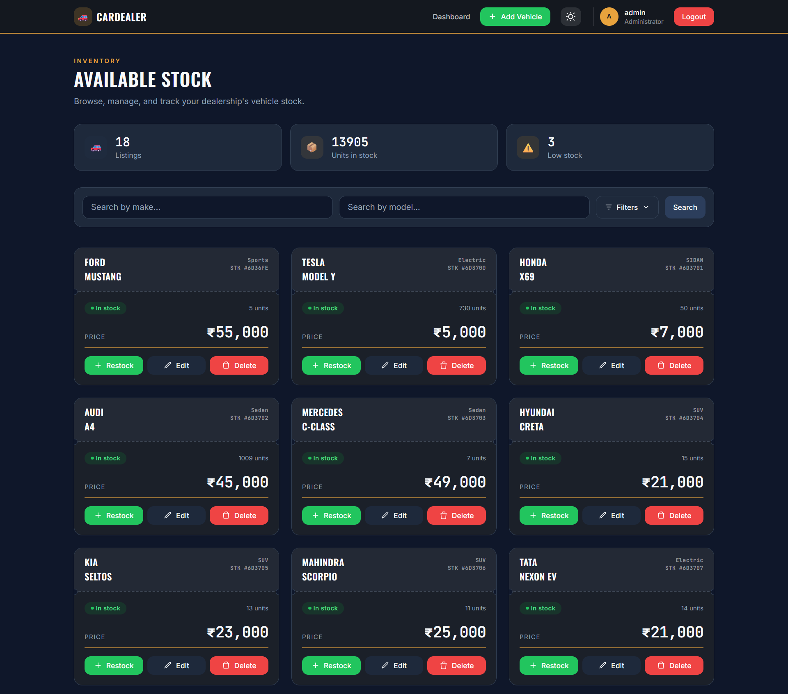
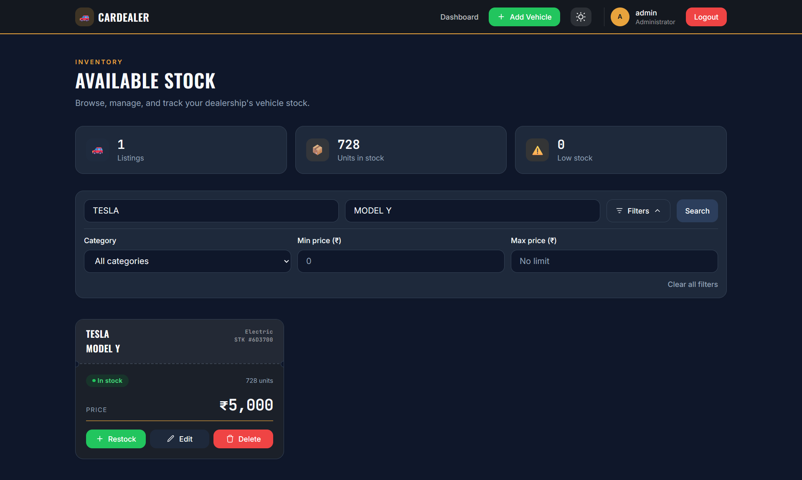
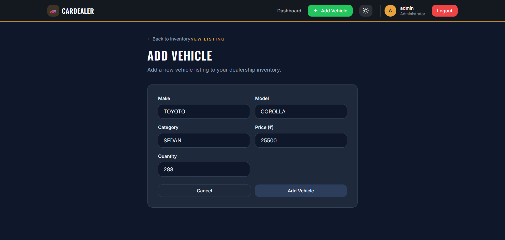
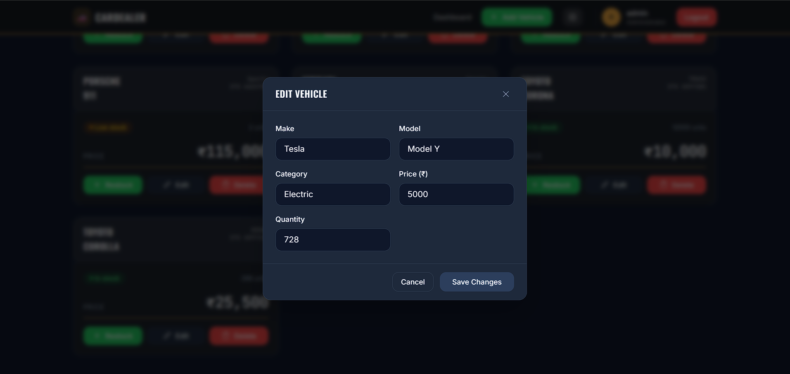
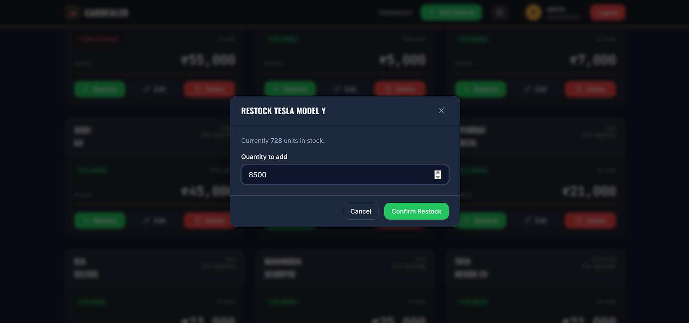
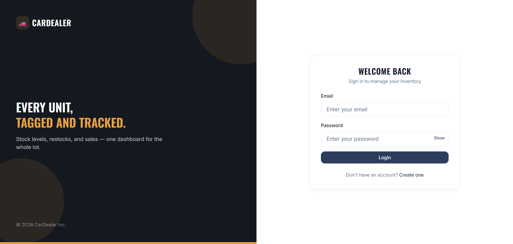
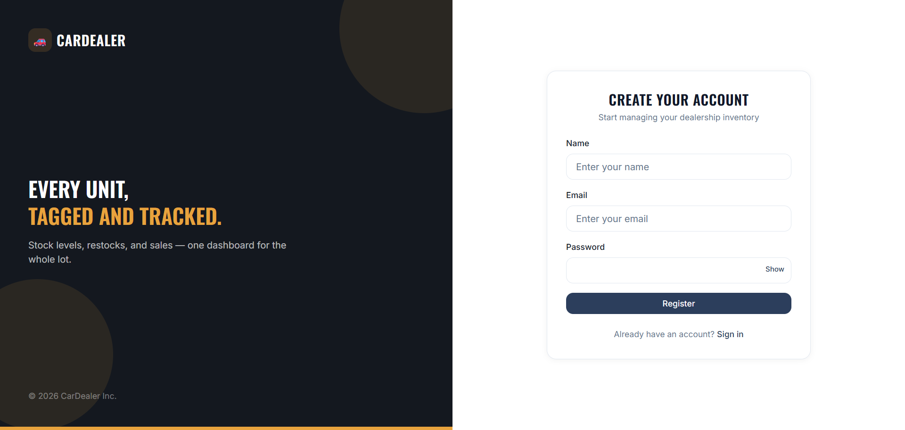

# 🚗 Car Dealership Inventory System

A full-stack inventory management platform for a car dealership, built test-first (TDD) with a clean, layered backend and a component-based React frontend.

Staff can browse, search, and filter the lot; admins can add, edit, restock, and remove vehicles; everything is guarded behind JWT auth with role-based access.

---

## Live Demo

- **Frontend:** [car-dealership-inventory-system-pearl.vercel.app](https://car-dealership-inventory-system-pearl.vercel.app/)
- **Backend API:** [car-dealership-inventory-system-n3ru.onrender.com](https://car-dealership-inventory-system-n3ru.onrender.com)

> Note: the backend is hosted on Render's free tier, so it may take up to ~50 seconds to spin up on the first request after a period of inactivity.

---

## Highlights

- **Test-driven backend** — Jest + Supertest, with a strict controller → service → model separation.
- **JWT authentication** with role-based access (`ADMIN` vs. standard user).
- **Search & filter** by make, model, category, and price range.
- **Responsive, dark-mode-aware UI** with persisted theme preference, loading skeletons, and toast feedback on every action.
- **Clean separation** — `backend` (Node/Express/MongoDB) and `frontend` (React + Vite + TypeScript + Tailwind) are fully independent apps.

---

## Key Features

**Auth & Access**

- Register / login with JWT-based sessions
- Role-based UI and endpoints (admins can manage inventory; all users can browse and purchase)
- Persisted session on reload, protected frontend routes

**Inventory Management**

- Add, view, edit, and remove vehicles (admin only)
- Restock existing vehicles (admin only)
- Purchase flow with automatic stock decrement
- Search and filter by make, model, category, and min/max price

**Frontend Experience**

- Component-based dashboard (cards, modals, search bar, stats, empty states)
- Loading skeletons for first load and search re-fetches
- Dark mode with persisted preference across sessions
- Toast notifications for every create/update/delete/search action

**Testing**

- Unit and integration test suites for controllers, services, and middleware

---

## Tech Stack

| Layer    | Stack                                  |
| -------- | -------------------------------------- |
| Backend  | Node.js, Express.js, MongoDB, Mongoose |
| Frontend | React, TypeScript, Vite, Tailwind CSS  |
| Auth     | JSON Web Tokens (JWT)                  |
| Testing  | Jest, Supertest                        |

---

## Folder Structure

```
car-dealership-inventory-system/
├── backend/
│   ├── .env
│   ├── package.json
│   └── src/
│       ├── app.js
│       ├── server.js
│       ├── config/              # DB connection, env config
│       ├── controllers/
│       │   ├── auth.controller.js
│       │   └── vehicle.controller.js
│       ├── middlewares/
│       │   └── auth.middleware.js   # protect / admin guards
│       ├── models/
│       │   ├── User.js
│       │   └── Vehicle.js
│       ├── routes/
│       │   ├── auth.routes.js
│       │   └── vehicle.routes.js
│       ├── services/
│       │   ├── auth.service.js
│       │   └── vehicle.service.js
│       └── tests/
│           ├── unit/
│           └── integration/
│
└── frontend/
    ├── package.json
    ├── tailwind.config.js
    ├── postcss.config.js
    └── src/
        ├── main.tsx
        ├── App.tsx
        ├── index.css
        ├── api/
        │   ├── axios.ts          # shared axios instance + auth header interceptor
        │   ├── auth.api.ts
        │   └── vehicle.api.ts
        ├── components/
        │   ├── Header.tsx
        │   ├── SearchBar.tsx
        │   ├── VehicleCard.tsx
        │   ├── VehicleCardSkeleton.tsx
        │   ├── InventoryStats.tsx
        │   ├── Modal.tsx
        │   ├── EditVehicleModal.tsx
        │   ├── RestockModal.tsx
        │   ├── FormField.tsx
        │   ├── AuthLayout.tsx
        │   ├── EmptyState.tsx
        │   └── ProtectedRoute.tsx
        ├── context/
        │   └── AuthContext.tsx
        ├── hooks/
        │   ├── useAuth.ts
        │   └── useDarkMode.ts
        └── pages/
            ├── Dashboard.tsx
            ├── Login.tsx
            ├── Register.tsx
            └── AddVehicle.tsx
```

---

## Quick Start

**Prerequisites:** Node.js v16+, MongoDB (local or Atlas)

### Backend

```bash
cd backend
npm install
```

Create a `.env` file in `backend/`:

```env
PORT=5000
MONGO_URI=your_mongodb_connection_string
JWT_SECRET=your_jwt_secret
CLIENT_URL=https://car-dealership-inventory-system-pearl.vercel.app
```

```bash
npm run dev
```

### Frontend

```bash
cd frontend
npm install
```

Create a `.env` file in `frontend/`:

```env
VITE_API_URL=https://car-dealership-inventory-system-n3ru.onrender.com
```

```bash
npm run dev
```

### Testing

```bash
cd backend
npm test
```

---

## API Reference

All routes are prefixed with `/api`. Routes marked **Protected** require a valid JWT; **Admin** routes additionally require an `ADMIN` role.

### Auth — `/api/auth`

| Method | Endpoint         | Access    | Description                        |
| ------ | ---------------- | --------- | ---------------------------------- |
| POST   | `/auth/register` | Public    | Register a new user                |
| POST   | `/auth/login`    | Public    | Log in and receive a JWT           |
| GET    | `/auth/me`       | Protected | Get the current authenticated user |
| POST   | `/auth/logout`   | Protected | Log out the current session        |

### Vehicles — `/api/vehicles`

| Method | Endpoint                 | Access    | Description                                                          |
| ------ | ------------------------ | --------- | -------------------------------------------------------------------- |
| GET    | `/vehicles`              | Protected | List all vehicles                                                    |
| GET    | `/vehicles/search`       | Protected | Search/filter by `make`, `model`, `category`, `minPrice`, `maxPrice` |
| POST   | `/vehicles`              | Admin     | Add a new vehicle                                                    |
| PUT    | `/vehicles/:id`          | Admin     | Update a vehicle                                                     |
| DELETE | `/vehicles/:id`          | Admin     | Remove a vehicle                                                     |
| POST   | `/vehicles/:id/purchase` | Protected | Purchase one unit (decrements stock)                                 |
| POST   | `/vehicles/:id/restock`  | Admin     | Restock a vehicle by a given quantity                                |

**Vehicle schema:** `make`, `model`, `category`, `price`, `quantity` (all required).

---

## Application Screenshots

### Dashboard View



### Search & Filter



### Add Vehicle View



### Edit Vehicle Modal



### Restock Vehicle Modal



### Login Page



### Register Page



---

## Test Report

| File            | Statements     | Branches       | Functions     | Lines          |
| --------------- | -------------- | -------------- | ------------- | -------------- |
| src             | 90.9% (10/11)  | 100% (2/2)     | 0% (0/1)      | 90.9% (10/11)  |
| src/controllers | 65.51% (38/58) | 33.33% (2/6)   | 63.63% (7/11) | 65.51% (38/58) |
| src/middlewares | 81.25% (13/16) | 91.66% (11/12) | 100% (2/2)    | 81.25% (13/16) |
| src/routes      | 100% (13/13)   | 100% (0/0)     | 100% (0/0)    | 100% (13/13)   |
| src/services    | 77.35% (41/53) | 63.63% (14/22) | 77.77% (7/9)  | 83.33% (40/48) |

---

## My AI Usage

**AI Tool Used:** Gemini

**How it was used:**

- Collaborated with Gemini to break down the assignment requirements and map out the technical strategy.
- Used Gemini to design the initial backend folder structure around strict clean-architecture and TDD standards.
- Used Gemini to generate the initial project boilerplate, including this README and the first failing unit tests.

**Reflection:** Using an AI assistant acted like having a senior mechanic in the bay with me — it helped organize my toolkit and set up a reliable assembly line (TDD) before I started writing the core business logic.

---

## Contributing

PRs welcome. Please keep changes test-first, and favor small, clearly scoped commits.

## License

MIT

## Contact

Project author: **Darshan**
